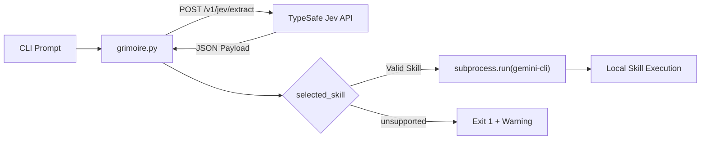

# Grimoire

> **gri·moire** /ɡrɪmˈwɑːr/ *noun*  
> A book of magic spells and invocations.

*I am currently rewatching **Black Clover** and was inspired to build something related. In the anime, mages channel their raw mana(magic) into spells inscribed within their grimoires. This project applies that same concept to developers by taking unstructured, messy prompts and structuring them through TypeSafe Jev to summon your own specialized local agent skills.*

[](https://opensource.org/licenses/MIT)
[](https://www.python.org/)

---

## Capabilities & Design Choices

Below are some of the key capabilities of this tool. I will build on these as I continue to further expand my personal dev tooling.

- **Strict Schema Enforcement**: Constrains model classification to a fixed enum of skills (`project-scoper`, `test-automation`, `doc-updater`, `unsupported`) with a minimum confidence score.
- **Deterministic Subprocess Execution**: Executes the selected skill via `gemini-cli --skill <name> --prompt '<context>'` in a standard subprocess without giving the model shell access.
- **Deterministic Fallback**: If an intent cannot be resolved to an active skill, exits with code 1 and suggests invoking `project-scoper` to author a new skill specification.
- **Skill Portability**: Works with any skills installed in the local `.agents/skills/` directory or globally in `~/.gemini/config/skills/`.

---

## Architecture



---

## Quickstart

### Prerequisites

- Python >= 3.10
- `gemini-cli` installed and available in `PATH`

### Setup

```bash
# Clone repository
git clone https://github.com/pranavbhupathiraju/Grimoire.git
cd Grimoire

# Install dependencies
pip install -r requirements.txt

# Configure credentials
cp .env.example .env
```

---

## Configuration

| Environment Variable | Description | Default |
| :--- | :--- | :--- |
| `TYPESAFE_API_KEY` | API key for authenticating with the TypeSafe Jev endpoint | *(Required)* |
| `TYPESAFE_API_ENDPOINT` | Target extraction endpoint URL | `https://api.typesafe.ai/v1/jev/extract` |

---

## Usage

### 1. Route to Architecture Agent (`project-scoper`)

```bash
python3 grimoire.py "Create an architectural spec and roadmap for distributed SQLite caching"
```

```text
Reading from the Grimoire...
  • Selected Skill : project-scoper
  • Confidence     : 98.0%
  • Context        : Create an architectural spec and roadmap for distributed SQLite caching

Summoning Skill: project-scoper
Executing command: gemini-cli --skill project-scoper --prompt 'Create an architectural spec and roadmap for distributed SQLite caching'
```

### 2. Route to Test Agent (`test-automation`)

```bash
python3 grimoire.py "Run pytest on the auth service and add tests for expired tokens"
```

```text
Reading from the Grimoire...
  • Selected Skill : test-automation
  • Confidence     : 96.0%
  • Context        : Run pytest on the auth service and add tests for expired tokens

Summoning Skill: test-automation
Executing command: gemini-cli --skill test-automation --prompt 'Run pytest on the auth service and add tests for expired tokens'
```

### 3. Route to Documentation Agent (`doc-updater`)

```bash
python3 grimoire.py "Generate a clean README for this repository with architecture diagrams"
```

```text
Reading from the Grimoire...
  • Selected Skill : doc-updater
  • Confidence     : 95.0%
  • Context        : Generate a clean README for this repository with architecture diagrams

Summoning Skill: doc-updater
Executing command: gemini-cli --skill doc-updater --prompt 'Generate a clean README for this repository with architecture diagrams'
```

### 4. Unsupported Intent Handling

```bash
python3 grimoire.py "Order a pepperoni pizza"
```

```text
Reading from the Grimoire...
  • Selected Skill : unsupported
  • Confidence     : 35.0%
  • Context        : Order a pepperoni pizza

The Grimoire does not have a spell inscribed for this intent.
Suggestion: Summon 'project-scoper' to design and forge a new skill specification.
   Example: python3 grimoire.py 'Use project-scoper to design a new agent skill for database migrations'
```

---

## Schema Contract

TypeSafe Jev extracts intent against the following JSON Schema:

```json
{
  "$schema": "https://json-schema.org/draft/2020-12/schema",
  "title": "GrimoireSkillRouting",
  "type": "object",
  "properties": {
    "selected_skill": {
      "type": "string",
      "enum": ["project-scoper", "test-automation", "doc-updater", "unsupported"]
    },
    "confidence_score": {
      "type": "number",
      "minimum": 0.0,
      "maximum": 1.0
    },
    "extracted_context": {
      "type": "string"
    }
  },
  "required": ["selected_skill", "confidence_score", "extracted_context"],
  "additionalProperties": false
}
```

---

## License

MIT